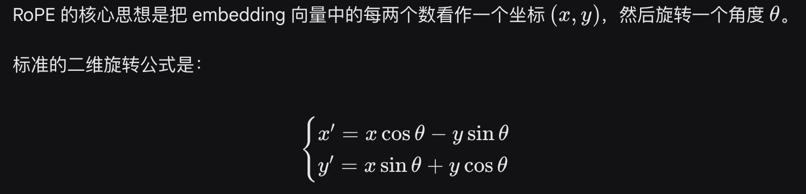
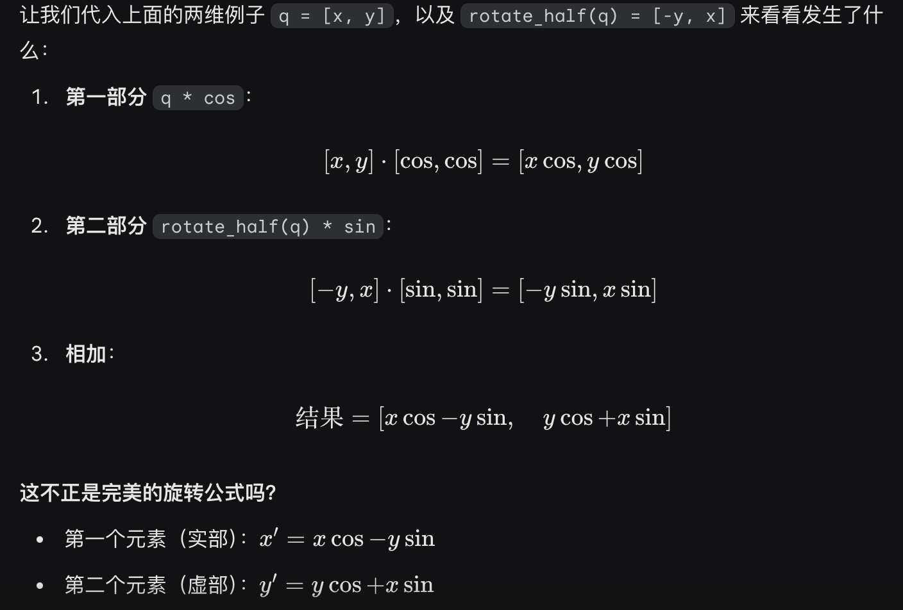

# 补充MiniMind中的一些细节
## Yarn
### ROPE
https://zhuanlan.zhihu.com/p/667864459

rotate_half()：




## MOE

##

# 【重要】一些有趣的思考

* 什么叫做**L**arge **L**anguage **M**odel (LLM)？
* 什么叫做多模态模型？

[这篇文章](https://www.jiqizhixin.com/articles/2024-09-15-3)完美吻合本人的想法：
大语言模型（LLM）名字虽然带有语言二字，但它们其实与语言关系不大，这只是历史问题，更确切的名字应该是自回归 Transformer
或者其他。LLM 更多是一种统计建模的通用技术，它们主要通过自回归 Transformer 来模拟 token 流，而这些 token
可以代表文本、图片、音频、动作选择、甚至是分子等任何东西。
因此，只要能将问题转化为模拟一系列离散 token 的流程，理论上都可以应用 LLM 来解决。
实际上，随着大型语言模型技术栈的日益成熟，我们可能会看到越来越多的问题被纳入这种建模范式。也就是说，问题固定在使用 LLM
进行『下一个 token 的预测』，只是每个领域中 token 的用途和含义有所不同。

[ZJU-LiXi老师](https://person.zju.edu.cn/xilics#694283)同样谈及过类似观点（原话大意如下）：
文本、视频、语音、动作等在人类看来属于「多模态」信号，但所谓的「模态」其实只是人类在信息存储方式上的一种分类概念。
就像`.txt`和`.png`文件，虽然在视觉呈现和高级表现形式上有所不同，但它们本质上并没有根本区别。
之所以出现「多模态」这个概念，仅仅是因为人类在不同的感知层面上对这些信号的分类需求。
然而，对于机器来说，无论信号来自何种「模态」，最终它们都只是以一串二进制的「单模态」数字序列来呈现。
机器并不会区分这些信号的模态来源，而只是处理和分析这些序列背后所承载的信息内容。

个人认为**G**enerative **P**retrained **T**ransformer (GPT) 比 **L**arge **L**anguage **M**odel (LLM)更为贴切，
因此本人表达上更习惯用"GPT"去代表LLM/VLM/类GPT架构的系列模型，而非为了蹭OpenAI的热度。

至此，我们可以用一句话总结GPT的所作所为：

GPT模型根据现有token预测输出下一个下下一个下下下一个token ...，直到模型输出结束符；此处的"token"其实并不需要一定是文本！

```text
> 对于LLM模型，如果需要理解"图片"，我们只要把"图片"作为对一种特殊的从来没见过的"外国语言"，通过"外语词典"翻译后即可作为特殊的语言输入LLM
> 对于LLM模型，如果需要理解"音频"，我们只要把"音频"作为对一种特殊的从来没见过的"外国语言"，通过"外语词典"翻译后即可作为特殊的语言输入LLM
> ...
```

# 📌 VLM Detail

MiniMind-V的结构仅增加Visual Encoder和特征投影两个子模块，增加模态混合分支，以支持多种模态信息的输入：


<u>**为了得到MiniMind-V，我们只需要完成这2件事即可：**</u>

1. 借助擅长翻译图片的 **"外语词典"** ，把图片从 **"外国语言"** 翻译为模型便于理解的 **"LLM语言"**
2. 训练微调LLM，使其和 **"外语词典"** 度过磨合期，从而更好的理解图片

"外语词典" 称之为Visual Encoder模型。
和LlaVA、Qwen-VL等视觉语言模型类似，MiniMind-V同样选用开源Clip系列模型作为Visual Encoder。
具体使用[clip-vit-base-patch16](https://huggingface.co/openai/clip-vit-base-patch16)，
一种基于 ViT-B/16 架构的经典Visual Encoder用于描述图像文本信息。
输入的图像尺寸为224x224，因为划分的Patch是16×16，所以会产生14*14=196个token作为encoder编码层的输入，
最终产生1×768维的嵌入向量用于和文本对计算误差。
我们并不需要最终嵌入表示，因此只取encoder层的输出，也就是VIT核心主干的输出特征即可。
它拿到前一层维度196×768大小的特征，我们把它作为196个visual token输入MiniMind-V。
与LLM的结合在获取图像encoder特征后，一方面需要把768维度的visual token对齐到LLM的文本token，
另一方面，要将图像特征映射到与文本embedding相同的空间，即文本token和原生的视觉token需要磨合并不能直接地一视同仁，
可以称之为跨模态的特征对齐。
[LlaVA-1](https://arxiv.org/pdf/2304.08485)使用简单的无偏线性变换完成了这一操作，效果很不错，MiniMind-V同样如此。


至此，MiniMind-V的内部结构变化已经呈现完毕。


# 输入输出的变化

下面，我们简单讨论MiniMind-V的外部输入输出的变化。

VLM的输入依然是一段文本，其中包含特殊的`<image>`占位符。
在计算文本嵌入后，可以将图像编码器生成的向量投影到该占位符对应的嵌入部分，替换掉原先的占位符embedding。
例如：

```text
<image>\n这个图像中有什么内容？
```

在`minimind-v`中，使用196个字符组成的 `@@@...@@@`
占位符代替图像，之所以是196个字符，前面有所提及：
任何图像都被clip模型encoder为196×768维的token，
因此`minimind-v`的prompt为：

```text
@@@......@@@\n这个图片描述的是什么内容？
```

计算完embedding和projection，并对图像部分token替换后整个计算过程到输出则和LLM部分没有任何区别。


一次性多图的实现方法就是通过注入多个`<image>`图像占位符进行实现，不需要修改任何框架。

<details>
<summary> 视频理解的拓展思路 </summary>

write by [@xinyanghuang7](https://github.com/xinyanghuang7)

对于多模态大模型的视频理解能力，一个可行的思路是参考现有MiniCPM-V 2.6 进行视频理解的Python示例。
主要思想是通过提取视频关键帧，而后进行多图推理。
因此，如果希望在MiniMind-V中添加视频理解能力，可以在现有多图训练的基础上，参考此python脚本中对于关键帧的提取方法，而后加大训练文件中支持图片的数量。
所支持的MAX_NUM_FRAMES越多，所消耗的显存越大。

```text
import torch
from PIL import Image
from transformers import AutoModel, AutoTokenizer
from decord import VideoReader, cpu  # pip install decord

model = AutoModel.from_pretrained('openbmb/MiniCPM-V-2_6', trust_remote_code=True,
                                  attn_implementation='sdpa',
                                  torch_dtype=torch.bfloat16)  # sdpa or flash_attention_2, no eager
model = model.eval().cuda()
tokenizer = AutoTokenizer.from_pretrained('openbmb/MiniCPM-V-2_6', trust_remote_code=True)

MAX_NUM_FRAMES = 64  # if cuda OOM set a smaller number


def encode_video(video_path):
    def uniform_sample(l, n):
        gap = len(l) / n
        idxs = [int(i * gap + gap / 2) for i in range(n)]
        return [l[i] for i in idxs]

    vr = VideoReader(video_path, ctx=cpu(0))
    sample_fps = round(vr.get_avg_fps() / 1)  # FPS
    frame_idx = [i for i in range(0, len(vr), sample_fps)]
    if len(frame_idx) > MAX_NUM_FRAMES:
        frame_idx = uniform_sample(frame_idx, MAX_NUM_FRAMES)
    frames = vr.get_batch(frame_idx).asnumpy()
    frames = [Image.fromarray(v.astype('uint8')) for v in frames]
    print('num frames:', len(frames))
    return frames


video_path = "video_test.mp4"
frames = encode_video(video_path)
question = "Describe the video"
msgs = [
    {'role': 'user', 'content': frames + [question]},
]

# Set decode params for video
params = {}
params["use_image_id"] = False
params["max_slice_nums"] = 2  # 如果cuda OOM且视频分辨率大于448*448可设为1

answer = model.chat(
    image=None,
    msgs=msgs,
    tokenizer=tokenizer,
    **params
)
print(answer)
```

</details>

至此，`MiniMind-V`的所有细节已经呈现完毕。
`MiniMind-V`的模型子类完全继承自`MiniMind`，
仅基于后者做**最小**变更而产生，
其核心算法改动`< 50行`，迁移难度极低。
因此可能和`LlAVA`等模型细节可能存在区别，但思路完全统一。

# 📌 Experiment

## Ⅰ 数据集

来源：[Chinese-LLaVA-Vision](https://huggingface.co/datasets/LinkSoul/Chinese-LLaVA-Vision-Instructions)
包含约57万张预训练图像，来自CC-3M和COCO 2014；
[llava-en-zh-300k](https://huggingface.co/datasets/BUAADreamer/llava-en-zh-300k)
包含300k条指令微调数据和15万张图像。
问答内容经过翻译，
对中文支持更友好，进一步经过整理并`resize`。

(pretrain_vlm_data.jsonl) 预训练数据集格式：

```json lines
{
  "conversations": [
    {
      "role": "user",
      "content": "提供给定图像的简要描述。\n<image>"
    },
    {
      "role": "assistant",
      "content": "橄榄油是自由使用的健康成分。"
    }
  ],
  "image": "GCC_train_002582585.jpg"
}
```

(sft_vlm_data.jsonl) 单图指令微调数据集格式：

```json lines
{
  "conversations": [
    {
      "role": "user",
      "content": "闹钟的位置对睡眠质量有什么影响？<image>"
    },
    {
      "role": "assistant",
      "content": "把数字闹钟放在床头柜..."
    }
  ],
  "image": "train-00000-of-00001_image_0_0.jpg"
}
```

(sft_vlm_data_multi.jsonl) 多图指令微调数据集格式：

```json lines
{
  "conversations": [
    {
      "role": "user",
      "content": "context: Source Image: <image> Target Image: <image> Instruction: What is the correct image edit instruction that can transfrom the source image to target image?<image>"
    },
    {
      "role": "assistant",
      "content": "take the people out of the back in the photo. Remove the two people behind the woman in the white dress and the man in the blue suit. remove people behind the couple in the centre"
    }
  ],
  "image": "0.jpg, 1.jpg"
}
```

